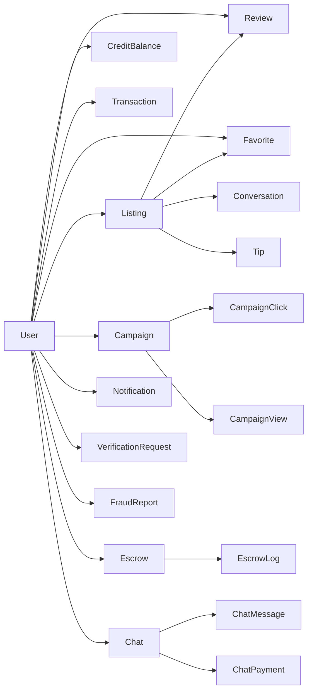

# 🔬 RubRhythm — Análise Completa do Site + Concorrentes

---

## 📋 Parte 1: O Que É o RubRhythm

**RubRhythm** é um **directory premium de body rubs e massagens** nos EUA, construído em **Next.js 15 + Prisma + MySQL + Tailwind CSS 4**. É um clone moderno e aprimorado do [RubRankings](https://rubrankings.com), com foco em design premium, segurança e escalabilidade.

### Stack Técnica

| Camada | Tecnologia |
|---|---|
| Frontend | Next.js 15, React 19, Tailwind CSS v4 |
| Backend | Next.js API Routes (35+ endpoints) |
| Banco de Dados | MySQL (via Prisma ORM, 25+ models) |
| Auth | NextAuth v5 (credentials + OAuth) |
| Realtime | Push Notifications (web-push) |
| State | Zustand + SWR |
| Deploy | Local dev (porta 1001) |

---

## 🗄️ Parte 2: Estrutura do Banco de Dados (25+ Models)

### Models Principais

| Model | Propósito |
|---|---|
| `user` | Usuários (role: user/admin), ban, créditos, verificação |
| `listing` | Anúncios com estado/cidade, featured, highlighted, bump up |
| `creditbalance` / `credittransaction` | Sistema financeiro de créditos |
| `transaction` | Histórico de pagamentos |
| `review` | Reviews com status pending/approved/rejected |
| `conversation` / `message` | Mensagens entre client ↔ provider |
| `chat` / `chatmessage` / `chatpayment` | Chat anônimo pago ($20 por 5 msgs) |
| `campaign` | Campanhas de marketing com clicks/views |
| `escrow` | Pagamentos protegidos com disputa |
| `verificationrequest` | Verificação com documento + selfie |
| `fraudreport` | Denúncias de fraude |
| `securitylog` / `suspiciousip` | Segurança e monitoramento de IPs |
| `globalsettings` | Configurações globais do sistema |
| `notification` / `adminnotification` | Notificações user e admin |
| `pushsubscription` | Push notifications web |

---

## 🎯 Parte 3: Features Implementadas

### Para Providers (Massagistas)

| Feature | Status | Descrição |
|---|---|---|
| ✅ Criar Listing | Implementado | Título, fotos, serviços, preços, localização |
| ✅ Featured (Basic) | Implementado | 7d = 15 credits, 30d = 45 credits |
| ✅ Featured (Premium) | Implementado | 7d = 20 credits, 30d = 60 credits (requer verificação) |
| ✅ Highlight | Implementado | 7d = $7 |
| ✅ Bump Up | Implementado | $3 por bump |
| ✅ Verificação | Implementado | Upload de documento + selfie |
| ✅ Provider Dashboard | Implementado | Analytics, views, estatísticas |
| ✅ Créditos | Implementado | Compra, saldo, histórico |
| ✅ Chat Anônimo | Implementado | Client ↔ Provider com pagamento |
| ✅ Tips | Implementado | Gorjetas via créditos |

### Para Clients (Visitantes)

| Feature | Status | Descrição |
|---|---|---|
| ✅ Busca por Cidade | Implementado | Geo-routing automático |
| ✅ Filtros Avançados | Implementado | Etnia, serviços, body type, etc |
| ✅ Favoritos | Implementado | Salvar listings |
| ✅ Reviews | Implementado | Com moderação |
| ✅ Mensagens | Implementado | Sistema de chat |
| ✅ Geo-Redirect | Implementado | Redireciona pela localização do browser |

### Admin Panel

| Feature | Status | Descrição |
|---|---|---|
| ✅ Dashboard | Implementado | Stats em tempo real |
| ✅ Gestão de Usuários | Implementado | Ban, search, roles |
| ✅ Gestão de Listings | Implementado | Aprovar, rejeitar, featured |
| ✅ Verificações | Implementado | Aprovar/rejeitar identidade |
| ✅ Financeiro | Implementado | Créditos, escrow, transações |
| ✅ Reviews | Implementado | Moderar comentários |
| ✅ Security Logs | Implementado | IPs suspeitos, fraudes |
| ✅ Campanhas | Implementado | Marketing analytics |

### SEO & Estrutura

- **Geo-routing**: `/united-states/[state]/[city]` — ideal para SEO local
- **6 cidades destaque**: Miami, Los Angeles, Houston, New York, Las Vegas, Atlanta
- **Browse by State**: Grid com todos os estados
- **Seção de Confiança**: "100% Verified Professionals"
- **Design premium**: Glassmorphism, gradients, animações, dark theme

---

## 🏆 Parte 4: Análise de Concorrentes

### 1. RubRankings (rubrankings.com) — Líder de Mercado

| Aspecto | Detalhe |
|---|---|
| **Modelo** | Freemium (listing grátis + features pagas) |
| **Tech** | PHP/Flynax Classifieds Engine (legacy) |
| **Pricing** | Feature 30d = $60, Feature 7d = $20, Bump = $3, Highlight 7d = $7 |
| **Pontos fortes** | Base de usuários enorme, SEO dominante, brand recognição |
| **Pontos fracos** | UI ultrapassada, tech stack legacy (PHP), sem dark mode, sem chat moderno |
| **Cobertura** | EUA todo, com foco em FL, TX, CA, NY |

### 2. Slixa (slixa.com) — Premium

| Aspecto | Detalhe |
|---|---|
| **Modelo** | Sistema de créditos ($30 = 30 credits até $4000 = 4800 credits) |
| **Features** | VIP upgrade (+2 credits/dia), Bumps (3 credits cada, 2h no topo), Available Now, Distance Dating |
| **Pontos fortes** | Design clean e premium, brand forte, sistema de créditos sofisticado |
| **Pontos fracos** | Foco mais em escort do que body rub, preços altos |
| **Diferencial** | Curadoria visual, fotos de alta qualidade |

### 3. Tryst.link — Moderno

| Aspecto | Detalhe |
|---|---|
| **Modelo** | Moeda virtual "TLC" (Tryst Love Coins), plano Lite (free) e Standard |
| **Features** | Planos de membership, pagamento em BTC, trial grátis de 1 mês |
| **Pontos fortes** | UI moderna, crypto-friendly, free trial |
| **Pontos fracos** | Foco em escort/companionship, não especificamente body rub |

### 4. BodyRubsMap — Nicho direto

| Aspecto | Detalhe |
|---|---|
| **Modelo** | Membership premium para ver reviews |
| **Pontos fortes** | Nicho exato de body rub |
| **Pontos fracos** | Pouca informação pública, UX limitada |

### 5. EroticMonkey (eroticmonkey.com)

| Aspecto | Detalhe |
|---|---|
| **Modelo** | Directory com reviews |
| **Pontos fortes** | Foco em reviews/rating detalhados |
| **Pontos fracos** | Instabilidade (downtime frequente), UI datada |

### 6. Craigslist / Classifieds genéricos

| Aspecto | Detalhe |
|---|---|
| **Modelo** | Grátis / baixo custo |
| **Pontos fortes** | Volume massivo de tráfego |
| **Pontos fracos** | Sem verificação, spam, sem features premium, ambiente inseguro |

---

## 📊 Parte 5: Comparação Direta — RubRhythm vs Concorrentes

| Feature | RubRhythm | RubRankings | Slixa | Tryst.link |
|---|---|---|---|---|
| **Dark Theme Premium** | ✅ | ❌ | ✅ | ✅ |
| **Tech Stack Moderna** | ✅ (Next.js 15) | ❌ (PHP) | ✅ | ✅ |
| **Sistema de Créditos** | ✅ | ✅ | ✅ | ✅ (TLC) |
| **Chat Anônimo Pago** | ✅ | ❌ | ❌ | ❌ |
| **Escrow/Pagamento Seguro** | ✅ | ❌ | ❌ | ❌ |
| **Verificação de Identidade** | ✅ (doc + selfie) | ✅ (básica) | ✅ | ✅ |
| **Provider Analytics** | ✅ | ❌ | ❌ | Básico |
| **Push Notifications** | ✅ | ❌ | ❌ | ❌ |
| **Fraud Reports** | ✅ | ❌ | ❌ | ❌ |
| **Campanhas de Marketing** | ✅ | ❌ | ❌ | ❌ |
| **Admin MCP-Ready** | ✅ (planejado) | ❌ | ❌ | ❌ |
| **SEO Geo-routing** | ✅ | ✅ | ✅ | ✅ |
| **Tips/Gorjetas** | ✅ | ❌ | ✅ (Gift Me) | ❌ |
| **Bump Up** | ✅ ($3) | ✅ ($3) | ✅ (3 credits) | ❌ |
| **Feature Listing** | ✅ ($15-60) | ✅ ($20-60) | ✅ (créditos) | ✅ (TLC) |

---

## 💡 Parte 6: Vantagens Competitivas do RubRhythm

### 🟢 Onde Você Ganha

1. **Tech Stack moderna** — Next.js 15 vs PHP do RubRankings. Performance, SEO server-side, e developer experience infinitamente superiores.

2. **Chat anônimo pago** — Feature exclusiva. Nenhum concorrente tem chat anônimo com monetização por mensagem ($20/5 msgs).

3. **Escrow system** — Pagamento protegido com disputas. Feature enterprise-level que nenhum concorrente direto oferece.

4. **Provider analytics** — Dashboard com métricas de views, clicks, e performance. RubRankings não tem isso.

5. **Admin Panel robusto** — Security logs, IP tracking, fraud reports, campaign analytics, MCP-ready.

6. **Preços competitivos** — Feature BASIC 25% mais barata que RubRankings no plano de 7 e 30 dias.

7. **Push notifications** — Engajamento superior via web push.

### 🔴 Onde Precisa Melhorar

1. **Base de usuários** — Zero providers vs milhares no RubRankings. O desafio #1.
2. **SEO authority** — Domínio novo (rubrhythm) vs rubrankings.com estabelecido há anos.
3. **Payment gateway** — Ainda não integrado com processador real (Stripe/PayPal).
4. **Mobile app** — Não tem app nativo (PWA manager existe mas limitado).
5. **Conteúdo** — Sem listings reais ainda para gerar tráfego orgânico.

---

## 🎯 Parte 7: Recomendações Estratégicas

| Prioridade | Ação | Impacto |
|---|---|---|
| 🔴 P0 | Integrar payment gateway real (Stripe/Crypto) | Sem isso, não há receita |
| 🔴 P0 | Seed initial listings (Florida + Texas) | Sem conteúdo = sem tráfego |
| 🟡 P1 | SEO agressivo (blog, city pages, schema markup) | Tráfego orgânico a médio prazo |
| 🟡 P1 | Marketing para providers (redes sociais, fóruns) | Lado da oferta é o gargalo |
| 🟢 P2 | PWA/Mobile experience | Mercado mobile-heavy |
| 🟢 P2 | Programa de referral (credits por indicação) | Crescimento viral |
| 🟢 P2 | A/B testing no pricing | Otimizar conversão |

---

> **Conclusão**: O RubRhythm tem uma stack técnica **superior** a todos os concorrentes diretos e features que nenhum deles oferece (escrow, chat pago, fraud system). O gap é **market presence** — resolver aquisição de providers e integração de pagamentos são os dois passos que separam o site de gerar receita real.
